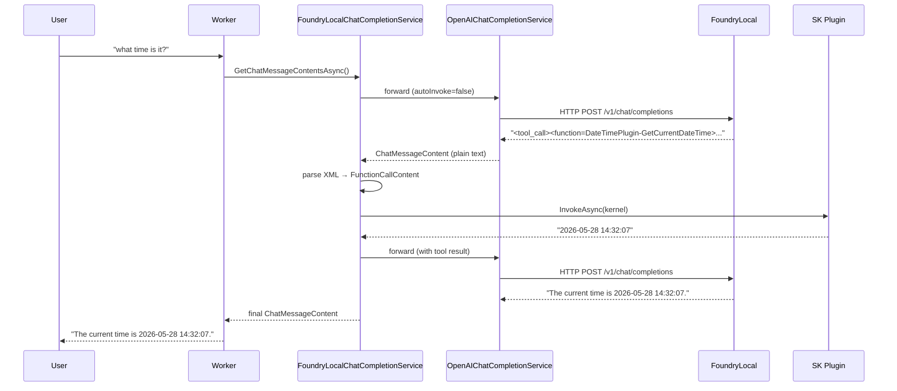

# Foundry Local connector for Semantic Kernel

A .NET integration library that bridges **[Microsoft Foundry Local](https://learn.microsoft.com/en-us/ai/foundry-local/overview)** with **[Semantic Kernel](https://learn.microsoft.com/en-us/semantic-kernel/overview/)**, enabling fully offline, on-device AI with function calling support — no Azure subscription or internet connection required at runtime.

---

## Why this exists

Foundry Local runs ONNX models locally via an OpenAI-compatible API. However, ONNX models output tool calls in a **non-standard XML format** in the response text instead of the standard OpenAI `tool_calls` JSON array. This means Semantic Kernel's built-in auto-invocation never fires.

This library solves that with `FoundryLocalChatCompletionService` — a transparent decorator that intercepts ONNX model's XML tool-call text, parses it, invokes the right SK plugin functions, and returns the final answer as if nothing unusual happened.

> For a full technical explanation, see [docs/function-calling.md](docs/function-calling.md).

---

## Features

- **Drop-in SK integration** — register with a single extension method; no changes to your normal SK code
- **Automatic function calling** — works around ONNX model's non-standard tool-call format transparently
- **Agentic loop** — supports multi-step reasoning (up to 5 iterations by default)
- **Error-resilient** — failed function invocations return a structured error message back to the model rather than crashing
- **Offline-first** — Foundry Local downloads and caches models; subsequent runs are fully offline

---

## Prerequisites

| Requirement | Details |
|---|---|
| OS | Windows 11 (or Windows 10 22H2+), macOS (Apple Silicon), or Linux |
| .NET | .NET 8 SDK or later |
| Foundry Local | Install via `winget install Microsoft.FoundryLocal` or from the [official page](https://learn.microsoft.com/en-us/ai/foundry-local/get-started) |
| Hardware | CPU is sufficient; GPU/NPU gives better performance |

---

## Quick start

**1. Clone and configure**

```bash
git clone https://github.com/your-username/FoundryLocal.SemanticKernel.git
cd FoundryLocal.SemanticKernel
```

**2. Run**

```bash
cd src/FoundryLocal.SemanticKernel.App
dotnet run
```

On first run, Foundry Local automatically downloads the model. Subsequent runs start instantly from cache.

**3. Chat**

```
> You: what time is it?
> Assistant: The current time is 2026-05-28 14:32:07.

> You: calculate 12 * 7 + 3
> Assistant: The result is 87.
```

---

## Using the library in your own app

**1. Add the project reference** (or reference the NuGet package when published):

```xml
<ProjectReference Include="..\FoundryLocal.SemanticKernel\FoundryLocal.SemanticKernel.csproj" />
```

**2. Register services in `Program.cs`:**

```csharp
builder.Services.AddOptions<FoundryLocalOptions>()
    .Bind(builder.Configuration.GetSection(nameof(FoundryLocalOptions)))
    .ValidateOnStart();

builder.Services.AddSingleton<IFoundryModelService, FoundryModelService>();

builder.Services
    .AddKernel().Plugins
        .AddFromType<YourPlugin>();

builder.Services.AddFoundryLocalChatCompletion(
    modelAlias: options.ModelAlias,
    endpoint:   new Uri($"{options.WebServiceUrl}/v1"));
```

**3. Start the model and chat:**

```csharp
// Start Foundry Local's web service for this model
await modelService.StartWebServiceWithModelAsync(ct);

var chat    = kernel.GetRequiredService<IChatCompletionService>();
var history = new ChatHistory("You are a helpful assistant.");
var settings = new FoundryLocalPromptExecutionSettings { Temperature = 0.7 };

history.AddUserMessage("What time is it?");
var response = await chat.GetChatMessageContentAsync(history, settings, kernel, ct);
```

---

## Configuration reference

All options live under `FoundryLocalOptions` in `appsettings.json`:

| Key | Type | Default | Description |
|---|---|---|---|
| `AppName` | `string` | `""` | Name passed to Foundry Local for identification |
| `WebServiceUrl` | `string` | *(required)* | Local endpoint, e.g. `http://127.0.0.1:52495` |
| `ModelAlias` | `string` | `qwen3.5-0.8b` | Model alias from the Foundry Local catalog |
| `LogLevel` | `string` | `Information` | Foundry Local internal log level |

> See the [Foundry Local model catalog](https://www.foundrylocal.ai/models) for available model aliases.

---

## Available plugins (demo app)

| Plugin | Function | Description |
|---|---|---|
| `DateTimePlugin` | `GetCurrentDateTime` | Returns current local date and time |
| `CalculatorPlugin` | `calculate` | Evaluates a math expression (e.g. `12 * 7 + 3`) |
| `FilePlugin` | `read_text_file` | Reads text content from a file path |

> To add your own plugins, see [docs/plugins.md](docs/plugins.md).

---

## How it works



> Deep dive: [docs/architecture.md](docs/architecture.md) | [docs/function-calling.md](docs/function-calling.md)

---

## Further reading

- [Foundry Local SDK](https://learn.microsoft.com/en-us/azure/foundry-local/reference/reference-sdk-current?tabs=windows&pivots=programming-language-csharp) — Microsoft Learn
- [Semantic Kernel overview](https://learn.microsoft.com/en-us/semantic-kernel/overview/) — Microsoft Learn
- [Semantic Kernel function calling](https://learn.microsoft.com/en-us/semantic-kernel/concepts/ai-services/chat-completion/function-calling) — how SK normally handles tool calls
- [Foundry Local model catalog](https://www.foundrylocal.ai/models) — available ONNX models and aliases
