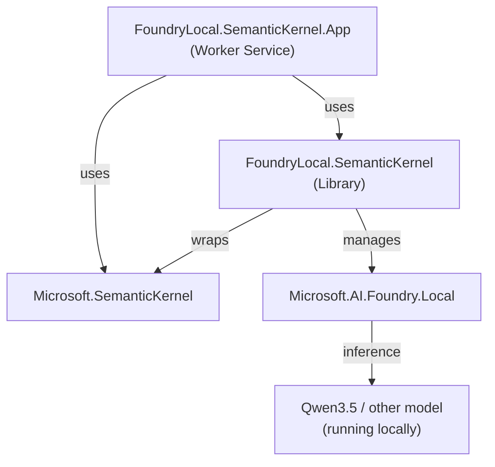
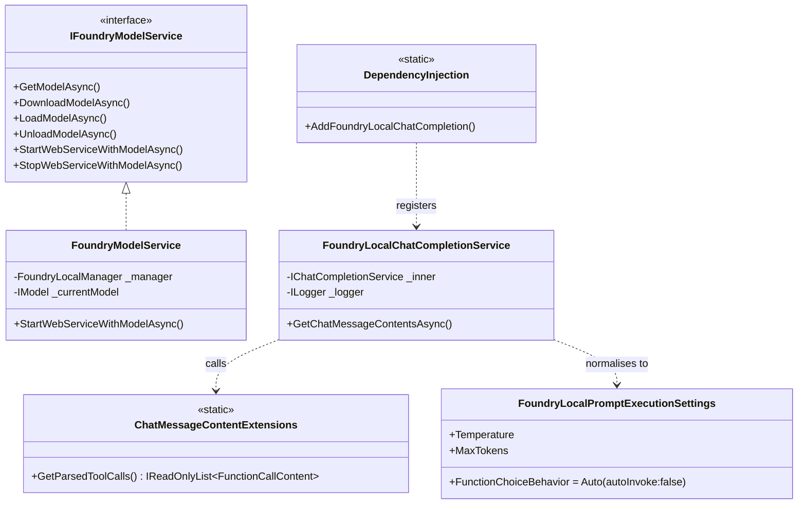
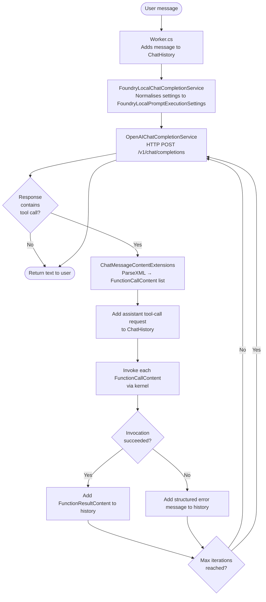

# Architecture

## Component overview



The solution is split into two projects:

| Project | Role |
|---|---|
| `FoundryLocal.SemanticKernel` | Reusable library — model lifecycle, SK decorator, XML parser |
| `FoundryLocal.SemanticKernel.App` | Demo worker app — plugins, configuration, entry point |

---

## Library internals



---

## Request lifecycle

This is what happens from the moment a user sends a message to when they receive a final answer.



**Key points:**
- The `_inner` service (`OpenAIChatCompletionService`) always runs with `autoInvoke: false` — it never tries to invoke functions itself
- `FoundryLocalChatCompletionService` owns the agentic loop and caps it at 5 iterations to prevent infinite loops
- On function invocation errors, a Markdown-formatted error message is fed back to the model so it can respond gracefully (e.g., "I was unable to read that file")

---

## Dependency injection wiring

`DependencyInjection.cs` provides one extension method:

```csharp
services.AddFoundryLocalChatCompletion(modelAlias, endpoint);
```

Internally it registers:

```
IChatCompletionService  ←  FoundryLocalChatCompletionService
                                └── OpenAIChatCompletionService (inner, not in DI)
```

The concrete `OpenAIChatCompletionService` is **not** registered in the DI container — it's created directly inside the factory lambda. This avoids conflicts if you were to also register a different `IChatCompletionService` for testing.

---

## Further reading

- [README — quick start](../README.md)
- [Function calling — the ONNX model problem and solution](function-calling.md)
- [Adding plugins](plugins.md)
