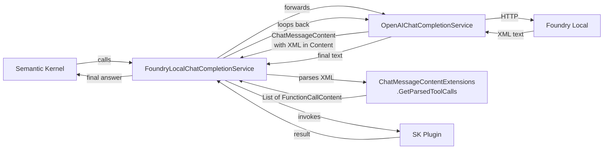

# Function Calling

## The problem

Semantic Kernel's built-in auto-invoke expects the model to return tool calls in the standard OpenAI format — a `tool_calls` array in the API response JSON:

```json
{
  "choices": [{
    "message": {
      "role": "assistant",
      "content": null,
      "tool_calls": [
        {
          "id": "call_abc",
          "type": "function",
          "function": { "name": "DateTimePlugin-GetCurrentDateTime", "arguments": "{}" }
        }
      ]
    }
  }]
}
```

**Foundry Local models do not do this.** Instead, when running through Foundry Local, they embed the tool call directly in the text `content` field:

```
<tool_call>
<function=DateTimePlugin-GetCurrentDateTime>
</function>
</tool_call>
```

With arguments it looks like this:

```
<tool_call>
<function=CalculatorPlugin-calculate>
<parameter=expression>
10 + 20 + 4 / 5.6 + 7.2
</parameter>
</function>
</tool_call>
```

Because the `tool_calls` array is empty, Semantic Kernel sees a plain text message and returns it directly to the caller — functions are never invoked.

> This is a known upstream issue caused by Foundry Local's runtime not applying Qwen3's chat template tool-call converter. Tracked in [vLLM #42021](https://github.com/vllm-project/vllm/issues/42021) and related inference backend issues.

---

## The solution: `FoundryLocalChatCompletionService`

This library fixes the problem with a **decorator** that wraps `OpenAIChatCompletionService`. It intercepts every response, checks the text content for the Qwen3 XML pattern, and if found, converts it into proper `FunctionCallContent` objects that Semantic Kernel understands.



The decorator is completely transparent — existing code that calls `IChatCompletionService` does not need to change.

---

## How the XML parser works

**Source:** `src/FoundryLocal.SemanticKernel/Extensions/ChatMessageContentExtensions.cs`

The parser runs on every response and uses three fast exit checks before starting regex work:

1. `string.IsNullOrWhiteSpace(text)` — skip empty responses
2. `text.Contains("<tool_call>")` — SIMD-accelerated scan; skip if no marker found
3. `message.Items.OfType<FunctionCallContent>().Any()` — skip if SK already detected tool calls (standard format)

If all checks pass, two source-generated regexes extract the data:

| Regex | Captures |
|---|---|
| `ToolCallRegex` | `name` (function identifier), `args` (everything inside `<function>`) |
| `FunctionCallParameterRegex` | `paramName`, `paramValue` for each `<parameter>` tag |

**Name splitting:** the model outputs `PluginName-FunctionName` (e.g. `DateTimePlugin-GetCurrentDateTime`). The parser splits on the first `-` to get the plugin name and function name separately, which is what SK's function registry expects.

**Args parsing — two formats supported:**

| First character | Format | Handling |
|---|---|---|
| `<` | `<parameter=name>value</parameter>` | `FunctionCallParameterRegex` |
| `{` | JSON `{"param": "value"}` | `JsonSerializer.Deserialize` |
| *(empty)* | No arguments | `FunctionCallContent` created with no args |

> The JSON fallback exists for compatibility with other models (e.g. Qwen2.5) that may use a JSON-in-content format instead.

---

## The agentic loop

After parsing, `FoundryLocalChatCompletionService` runs a loop:

```
iteration 1:  model response → parse → invoke functions → add results to history
iteration 2:  model response (with tool results) → parse → no more tool calls
              → return final answer
```

This handles cases where the model decides it needs multiple tool calls across turns (e.g., first gets the current time, then uses it to calculate something).

The loop is capped at **5 iterations** (`MaxIterations`) to prevent infinite loops if the model gets stuck requesting the same function repeatedly.

---

## `FoundryLocalPromptExecutionSettings`

This class extends `OpenAIPromptExecutionSettings` and always sets `FunctionChoiceBehavior = Auto(autoInvoke: false)`.

**Why `autoInvoke: false`?** Setting it to `true` would make SK's `OpenAIChatCompletionService` try to run its own agentic loop — but since the `tool_calls` field is empty, it would do nothing and return the raw XML text. By forcing `false`, we ensure our decorator is the sole owner of the loop.

Callers just use `FoundryLocalPromptExecutionSettings` instead of `OpenAIPromptExecutionSettings` and don't need to think about this detail.

---

## Further reading

- [Semantic Kernel — Function calling concepts](https://learn.microsoft.com/en-us/semantic-kernel/concepts/ai-services/chat-completion/function-calling)
- [Qwen3 tool calling documentation](https://qwen.readthedocs.io/en/latest/framework/function_call.html)
- [Architecture overview](architecture.md)
